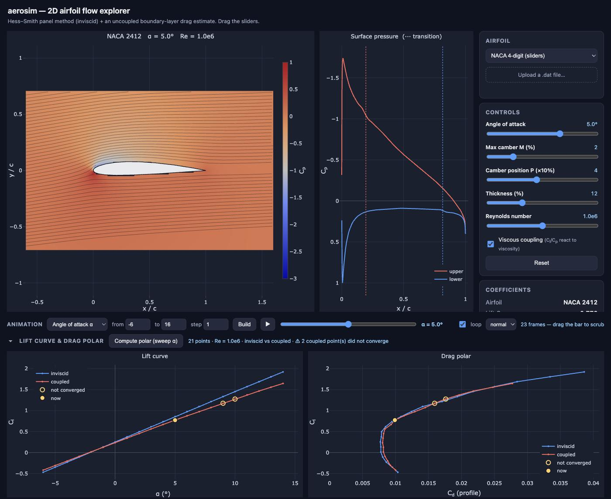

<h1 align="center">
  <picture>
    <source media="(prefers-color-scheme: dark)" srcset="gallery/logo/aerosim-logo-dark.svg">
    
  </picture>
</h1>

<p align="center">
  <a href="LICENSE"></a>
  <a href="https://www.python.org/downloads/"></a>
</p>

An interactive **2D airfoil aerodynamics simulator** built from scratch in Python.
It solves the incompressible potential-flow field around an airfoil with a
**Hess–Smith panel method** and lets you explore lift, pressure, and streamlines
in real time in your browser. The solver is the Python package `aerosim`, in
`src/aerosim/`.




## Quick start

You need [uv](https://docs.astral.sh/uv/getting-started/installation/); on first
run it fetches Python 3.12 and every dependency for you.

```bash
git clone https://github.com/markccchiang/Aerodynamic-Simulation-2D.git
cd Aerodynamic-Simulation-2D
uv run python src/web.py         # launch the web UI -> http://127.0.0.1:8000
uv run python src/validate.py    # run the physics validation suite
```

Drag the sliders to change the angle of attack, Reynolds number, and the NACA
4-digit shape (`MPXX` = camber %, camber position, thickness %), or load your own
airfoil (see [Loading airfoils](guide/airfoils.md)). The flow field, surface
pressure plot, and the lift/drag/moment coefficients all update live.

To drive the solver from your own script or notebook instead, see
[Using the solver from Python](guide/using-python.md).

## Documentation

| Guide | What it covers |
|-------|----------------|
| [Web UI](guide/web-ui.md) | how to use the browser front-end, control by control, with screenshots |
| [Using the solver from Python](guide/using-python.md) | importing `aerosim` in scripts and notebooks, a worked example, and what a solve returns |
| [Loading airfoils](guide/airfoils.md) | Selig and Lednicer `.dat` files, the bundled samples, and the circle / golf-ball pair |
| [How it works](guide/how-it-works.md) | the panel method, the viscous drag correction, and two-way coupling |
| [Architecture](guide/architecture.md) | the three layers, how data flows through them, and the design decisions behind them |
| [Validation](guide/validation.md) | what `src/validate.py` checks, group by group |
| [Development](guide/development.md) | project layout and possible next steps |
| [References](guide/references.md) | the textbooks, papers and data sources behind each method |

### Building the Sphinx docs

The aerodynamic theory behind all of it — the governing equations, why a panel
method solves them, the integral boundary-layer method, the viscous–inviscid
coupling, and how the validation cases are chosen — is written up in full as
Sphinx documentation under [`docs/`](docs/). Sphinx and its theme are in the
project's `dev` dependency group, so `uv sync` installs them:

```bash
uv sync                                        # installs the docs toolchain (dev group)
uv run sphinx-build -M html docs docs/_build   # build -> docs/_build/html/index.html
./open-html.sh                                 # open it in a browser (macOS or Linux)
```

`cd docs && uv run make html` does the same build through the Makefile. The
figures are generated by **running the solver at build time**, so they always
match the code — which also means that after changing the physics you should
rebuild from clean (`rm -rf docs/_build` first), or figures cached by the
previous build survive. A clean build should finish with zero warnings.

## License

Released under the [MIT License](LICENSE) — free to use, modify and redistribute,
including in commercial and closed-source work, provided the copyright notice
travels with it. Every dependency is permissively licensed as well (NumPy, SciPy
and uvicorn under BSD, FastAPI and pydantic under MIT, matplotlib under the PSF
licence, and Plotly.js under MIT), so there is no copyleft obligation anywhere in
the stack.
