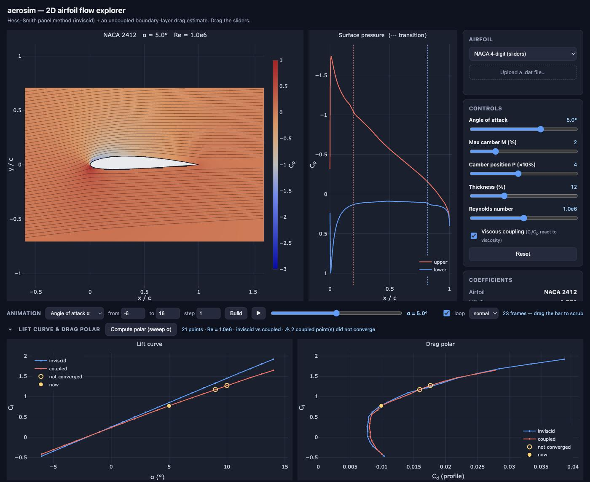

# aerosim

An interactive **2D airfoil aerodynamics simulator** built from scratch in Python.
It solves the incompressible potential-flow field around an airfoil with a
**Hess–Smith panel method** and lets you explore lift, pressure, and streamlines
in real time in your browser.



## Quick start

```bash
uv run python src/web.py         # launch the web UI -> http://127.0.0.1:8000
uv run python src/validate.py    # run the physics validation suite
```

Drag the sliders to change the angle of attack, Reynolds number, and the NACA
4-digit shape (`MPXX` = camber %, camber position, thickness %), or load your own
airfoil (see below). The flow field, surface pressure plot, and the
lift/drag/moment coefficients all update live.

## Web UI

`src/web.py` starts a small **FastAPI** backend that drives the solver and returns
JSON (geometry, a `Cp` field, streamlines, surface pressure, and coefficients); a
single **Plotly.js** page renders it with live sliders. No build step — open the
printed URL. Besides the NACA sliders, the **Airfoil** panel lets you pick a
bundled sample or **upload your own `.dat` file** (see below).

Below the flow view, a **Lift curve & drag polar** panel sweeps the angle of
attack (the **Compute polar** button) and plots `Cl` vs α and the drag polar
(`Cl` vs `Cd`), marking the current operating point. With **Viscous coupling**
on, it overlays the inviscid and coupled curves so the viscous decambering is
visible directly; coupled points where the iteration did not converge (it stops
converging as you approach stall) are ringed in amber rather than drawn as
settled answers.

Between the flow view and the polar sits an **Animation** strip: choose angle of
attack, max camber M, camber position P or thickness, give it a from/to/step
range, and **Build** sweeps that one parameter and plays the result back — the
flow field, surface pressure and coefficients all follow the sweep. Frames are
solved once and cached, so scrubbing, looping and changing speed never re-solve.
The sliders are left alone while it plays (each plot titles itself with what it
is showing), and touching any of them stops playback and returns to live mode. A
loaded `.dat` airfoil can only sweep α, since M/P/t are NACA shape digits.

The web page is a thin front-end — all physics lives in the UI-agnostic solver
core, which you can also drive directly from a script or notebook.

## Loading airfoils (`.dat` files)

Beyond NACA 4-digit shapes, aerosim loads arbitrary airfoil coordinate files in
both common layouts — **Selig** (one `x y` per line, TE → upper → LE → lower →
TE) and **Lednicer** (a count line then upper/lower blocks) — auto-detected. The
points are normalised to unit chord and re-paneled onto a cosine distribution so
the solver gets consistent resolution regardless of how the file was sampled.

```python
from aerosim import airfoil_from_dat, Geometry, solve
x, y = airfoil_from_dat("clarky.dat")     # path or raw .dat text
sol = solve(Geometry(x, y), alpha_deg=4.0, re=1e6)
```

A few sample airfoils ship in `src/aerosim/airfoils/` and appear in the web UI's
dropdown; the web upload button reads any `.dat` you drop in.

## How it works

The airfoil surface is split into ~160 flat **panels**. Each panel carries a
constant-strength **source** (one unknown per panel) plus one shared
**vortex** strength. The unknowns are found from:

- **flow tangency** — no flow passes through the surface (one equation per panel), and
- the **Kutta condition** — flow leaves the trailing edge smoothly (one equation),

giving an `(N+1) x (N+1)` linear system. Its matrix depends only on the airfoil
*geometry* — the angle of attack enters through the right-hand side alone — so it
is factorized once per airfoil and reused, which is what makes an angle-of-attack
sweep and the viscous coupling iteration cheap. From the surface velocities we get
the pressure coefficient `Cp = 1 - (V/V∞)²`, then integrate pressure for the lift
coefficient `Cl` and moment `Cm`.

This is *inviscid potential flow*: it predicts lift and pressure distributions
well at small angles, but the panel solve itself has no viscosity, so its pressure
drag is **~0** (d'Alembert's paradox) and it has no stall.

### Viscous drag correction

On top of the inviscid solve, an **uncoupled boundary-layer correction** estimates
the *profile drag* (`Cd`) that potential flow misses. From the inviscid surface
velocities it marches an integral boundary-layer method along each surface —
**Thwaites** (laminar) → **Michel** transition → **Head's entrainment method**
(turbulent) — and applies the **Squire–Young** formula at the trailing edge to get
drag. It also locates transition and flags trailing-edge separation.

By default this is *one-way* (uncoupled): lift, pressure, and the d'Alembert check
are unchanged. Pass a chord-based Reynolds number to switch it on:

```python
from aerosim import naca4, Geometry, solve
sol = solve(Geometry(*naca4("0012")), alpha_deg=4.0, re=1e6)
print(sol.cd_visc)        # ~0.009 profile drag; sol.cd stays ~0 (d'Alembert)
```

In the web UI, the **Reynolds** slider drives it live: `Cd` shows in the title and
transition points are marked on the pressure plot.

### Two-way viscous–inviscid coupling

Add `couple=True` to feed the boundary layer **back into** the solve. The
displacement thickness is modelled as a small wall-blowing velocity
(`v_n = d(Ue·δ*)/ds`) added to the flow-tangency condition, and the solve is
iterated to convergence. Now lift and pressure **react to viscosity** — the
airfoil effectively sees a slightly thicker, decambered shape, so lift drops a
little and the suction peak softens (real "viscous decambering"):

```python
inv = solve(Geometry(*naca4("2412")), alpha_deg=5.0, re=1e6)
vis = solve(Geometry(*naca4("2412")), alpha_deg=5.0, re=1e6, couple=True)
print(inv.cl, vis.cl)          # e.g. 0.857 -> 0.773
print(vis.coupled, vis.n_iter, vis.converged)   # True 13 True
```

This is **direct** coupling: robust for attached and mildly separated flow, and it
reports `Solution.converged`. It is *not* a post-stall model — through massive
separation the direct iteration won't converge (that needs a semi-inverse scheme).
In the web UI, tick **Viscous coupling** to drive it live.

## Theory documentation

The aerodynamics the simulator implements is written up in full under `docs/` —
governing equations, why a panel method solves them, the integral boundary-layer
method, the viscous–inviscid coupling, and how the validation cases are chosen.
The figures are generated by **running the solver at build time**, so they always
match the code.

```bash
uv sync                                        # installs the docs toolchain (dev group)
uv run sphinx-build -M html docs docs/_build   # -> docs/_build/html/index.html
./open-html.sh                                 # open it (macOS)
```

## Project layout

| File | Responsibility |
|------|----------------|
| `src/aerosim/airfoil.py`  | NACA 4-digit geometry + cosine-spaced paneling |
| `src/aerosim/airfoil_io.py` | load `.dat` files (Selig/Lednicer), normalize + re-panel |
| `src/aerosim/airfoils/`   | bundled sample airfoil `.dat` files |
| `src/aerosim/panel.py`    | Hess–Smith solver — influence coefficients, Kutta, `Cp`/`Cl`/`Cm` |
| `src/aerosim/flowfield.py`| velocity field on a grid; matplotlib-free streamline integrator |
| `src/aerosim/boundary_layer.py` | uncoupled viscous BL correction — profile drag, transition, separation |
| `src/aerosim/webapp.py`   | FastAPI backend (JSON API) for the web UI |
| `src/aerosim/static/`     | single-page Plotly.js front-end (`index.html`, `app.js`, `styles.css`) |
| `src/web.py`              | entry point — web server (uvicorn) |
| `src/validate.py`         | checks against thin-airfoil theory & known results |
| `docs/theory/`            | Sphinx write-up of the theory, with solver-generated figures |

The physics core is UI-agnostic — you can drive it from a script or a notebook,
not just the web UI.

## Validation

This is the project's test suite — **run `uv run python src/validate.py` after any change to the physics core** (`src/aerosim/panel.py`, `airfoil.py`, `boundary_layer.py`, or `airfoil_io.py`); it runs in well under a second.

`validate.py` confirms the solver against analytical / reference results:

- symmetric airfoil produces zero lift at zero incidence;
- lift-curve slope ≈ `2π(1 + 0.77·t/c)` per radian;
- cambered NACA 2412 gives `Cl ≈ 0.25` at α = 0 and a nose-down `Cm`;
- pressure drag ≈ 0 (d'Alembert);
- peak surface `Cp ≈ 1` at the stagnation point;
- lift from the pressure integral matches the Kutta–Joukowski circulation.

For the viscous correction it also checks:

- profile `Cd` of NACA 0012 ≈ published data at Re = 10⁶;
- `Cd` falls with Reynolds number and rises with angle of attack;
- transition advances toward the leading edge as Reynolds number rises;
- the inviscid `Cl`/`Cd` are untouched by the uncoupled estimate (`couple=False`);
- the flow is attached at α = 0 and separates as it approaches stall.

For the two-way coupling (`couple=True`):

- coupling reduces `Cl` (viscous decambering) and softens the suction peak;
- the lift loss grows as Reynolds number falls (thicker boundary layer);
- a symmetric airfoil at α = 0 gains no spurious lift, and an attached case
  converges; `couple=True` without a Reynolds number raises.

And for `.dat` loading:

- Selig and Lednicer files round-trip to the same `Cl` as the direct geometry;
- coordinates are normalized to unit chord (scale/offset invariant);
- every bundled sample loads, re-panels, and solves.

## Possible next steps

- **Semi-inverse coupling** to push the viscous solve through separation toward
  real post-stall behaviour — the current `couple=True` is *direct* coupling, so
  it captures viscous decambering but not massive separation.
- A drag breakdown (friction vs form vs induced) and a `Cl`/`Cd` (L/D) readout
  on the polar.
