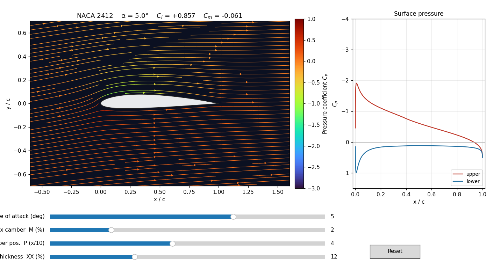

# aerosim

An interactive **2D airfoil aerodynamics simulator** built from scratch in Python.
It solves the incompressible potential-flow field around a NACA airfoil with a
**Hess–Smith panel method** and lets you explore lift, pressure, and streamlines
in real time with sliders.



## Quick start

```bash
uv run python src/main.py        # launch the interactive explorer
uv run python src/validate.py    # run the physics validation suite
```

Drag the sliders to change the angle of attack and the NACA 4-digit shape
(`MPXX` = camber %, camber position, thickness %). The flow field, surface
pressure plot, and the lift/moment coefficients all update live.

## How it works

The airfoil surface is split into ~160 flat **panels**. Each panel carries a
constant-strength **source** (one unknown per panel) plus one shared
**vortex** strength. The unknowns are found from:

- **flow tangency** — no flow passes through the surface (one equation per panel), and
- the **Kutta condition** — flow leaves the trailing edge smoothly (one equation),

giving an `(N+1) x (N+1)` linear system. From the surface velocities we get the
pressure coefficient `Cp = 1 - (V/V∞)²`, then integrate pressure for the lift
coefficient `Cl` and moment `Cm`.

This is *inviscid potential flow*: it predicts lift and pressure distributions
well at small angles, but has no viscosity, so it shows **no drag** (d'Alembert's
paradox) and **no stall**.

## Project layout

| File | Responsibility |
|------|----------------|
| `src/aerosim/airfoil.py`  | NACA 4-digit geometry + cosine-spaced paneling |
| `src/aerosim/panel.py`    | Hess–Smith solver — influence coefficients, Kutta, `Cp`/`Cl`/`Cm` |
| `src/aerosim/flowfield.py`| velocity field on a grid for streamlines |
| `src/aerosim/app.py`      | interactive matplotlib UI |
| `src/main.py`             | entry point that launches the explorer |
| `src/validate.py`         | checks against thin-airfoil theory & known results |

The physics core (`panel.py`) is UI-agnostic — you can drive it from a script,
a notebook, or a future web front-end.

## Validation

This is the project's test suite — **run `uv run python src/validate.py` after any change to the physics core** (`src/aerosim/panel.py` or `airfoil.py`); it runs in well under a second.

`validate.py` confirms the solver against analytical / reference results:

- symmetric airfoil produces zero lift at zero incidence;
- lift-curve slope ≈ `2π(1 + 0.77·t/c)` per radian;
- cambered NACA 2412 gives `Cl ≈ 0.25` at α = 0 and a nose-down `Cm`;
- pressure drag ≈ 0 (d'Alembert);
- peak surface `Cp ≈ 1` at the stagnation point;
- lift from the pressure integral matches the Kutta–Joukowski circulation.

## Possible next steps

- Add a viscous boundary-layer correction (e.g. an integral method) to predict
  drag and stall — this is essentially what XFOIL does.
- Load arbitrary airfoil coordinate files (`.dat`) instead of only NACA shapes.
- Plot `Cl` vs α and the drag polar.
- Port the UI to the web (the solver is already independent of matplotlib).
