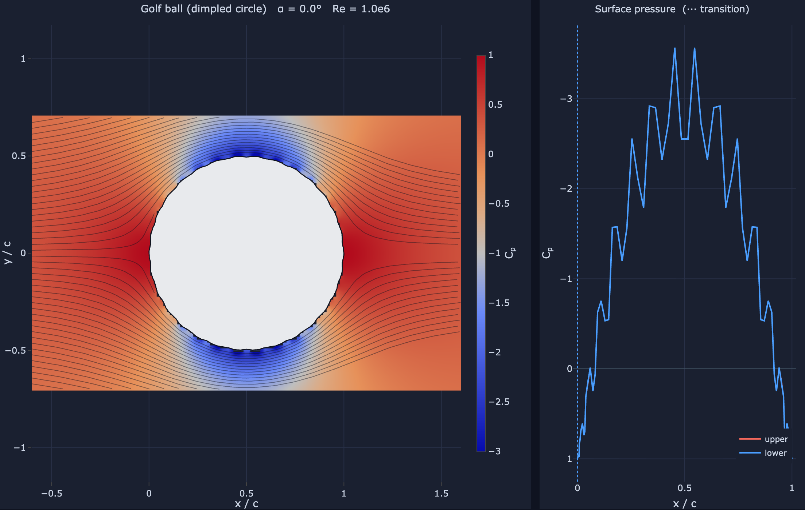

# Loading airfoils (`.dat` files)

← [Back to the README](../README.md)

Beyond NACA 4-digit shapes, aerosim loads arbitrary airfoil coordinate files in
both common layouts — **Selig** (one `x y` per line, TE → upper → LE → lower →
TE) and **Lednicer** (a count line then upper/lower blocks) — auto-detected. The
points are normalised to unit chord and re-paneled onto a cosine distribution so
the solver gets consistent resolution regardless of how the file was sampled.

> [!NOTE]
> The code examples assume `src/` is on the import path — see
> [Using the solver from Python](using-python.md).

```python
from aerosim import airfoil_from_dat, Geometry, solve
x, y = airfoil_from_dat("src/aerosim/airfoils/naca4415.dat")   # path or raw .dat text
sol = solve(Geometry(x, y), alpha_deg=4.0, re=1e6)
```

A few samples ship in `src/aerosim/airfoils/` and appear in the web UI's
dropdown; the web upload button reads any `.dat` you drop in.

## A bluff body: the bundled golf ball

Two of those samples are not airfoils at all. `circle.dat` is the section of a
smooth sphere, and `golfball.dat` is the *same* circle carrying 30 raised-cosine
dimples at real proportions — 0.6 % of the diameter deep, the equivalent of a
0.010 in dimple on a 1.68 in ball. They are a controlled pair, identical apart
from the dimples, and they are here to show where the model ends.



At α = 0 the field is perfectly fore-and-aft symmetric — stagnation points front
**and** back, no wake. That is d'Alembert's paradox made visible: the pressure
drag is exactly zero, and dimples cannot change a drag that is identically zero
for *any* closed body in potential flow. The sawtooth in the surface pressure is
the dimples, and that part is honest — short-wavelength waviness perturbs the
velocity by ~36 % even at 0.6 % amplitude.

What it cannot show is the one thing dimples are actually for. Real dimples trip
the boundary layer turbulent so it holds on ~30° further round, shrinking the
wake and roughly halving the drag. Here the attached-flow integral BL moves
separation the *wrong way*, and a circle at α ≠ 0 develops spurious lift because
the Kutta condition is anchored to an arbitrary node. The
[validation chapter](../docs/theory/validation.rst) works through all three.
