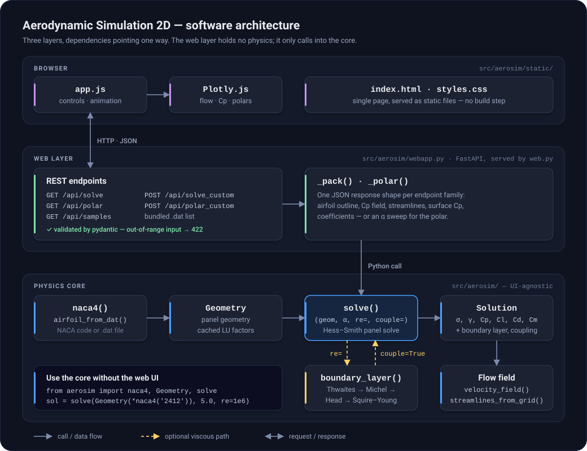

# Software architecture

← [Back to the README](../README.md)

The code is three layers with dependencies pointing one way: a static browser
front-end calls a thin FastAPI web layer, which calls a UI-agnostic physics core.
The core never imports the web layer, and the web layer contains no physics —
every solve and polar endpoint ends in the same `solve()` you can call from a
script or notebook (see [Using the solver from Python](../README.md#using-the-solver-from-python)).

A few decisions shape everything else:

- **One data contract.** `solve()` returns a `Solution` dataclass — source
  strengths, circulation, surface `Cp` and velocity, `Cl`/`Cd`/`Cm`, and, when a
  Reynolds number is given, the boundary-layer result and coupling status.
  Everything downstream reads from it.
- **One place for the singularity math.** `induced()` in `panel.py` computes the
  source and vortex influence coefficients for both the solver (at the panel
  control points) and the flow field (on the plotting grid).
- **The expensive step runs once per airfoil.** The influence matrix depends only
  on geometry, so its LU factorization is cached on the `Geometry`; an
  angle-of-attack sweep or a coupling iteration only re-solves the right-hand side.
- **Viscosity is opt-in, in two strengths.** `re=` runs the boundary layer as a
  one-way post-process that leaves the inviscid answer untouched; `couple=True`
  feeds the displacement thickness back as a wall-transpiration velocity and
  iterates to convergence.
- **One geometry convention.** Nodes run trailing edge → upper surface → leading
  edge → lower surface → trailing edge. The Kutta condition, the stagnation-point
  split in the boundary layer, and the `.dat` loader all rely on it.
- **A thin, static front-end.** There is no build step. `app.js` debounces slider
  input, discards superseded responses, and caches animation frames so playback
  never re-solves. The web layer builds every solve response in one function,
  `_pack()`, and rejects out-of-range requests in its validation layer.

The per-file breakdown is in [Development](development.md#project-layout),
and [How it works](how-it-works.md) covers the method itself.
