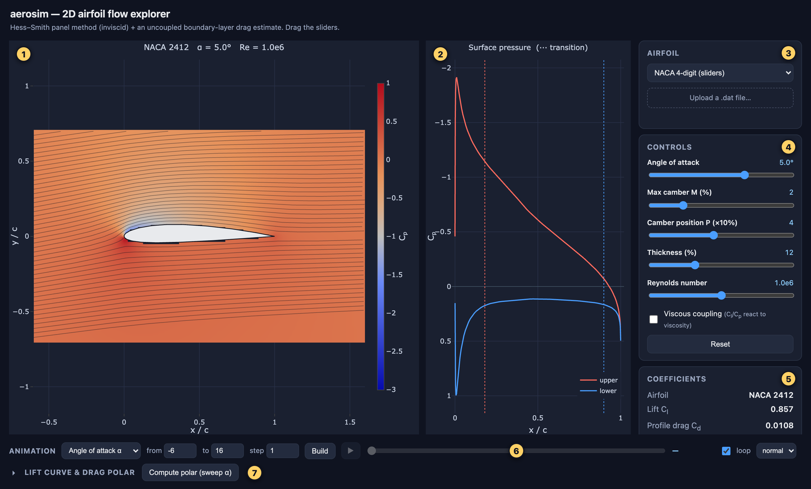
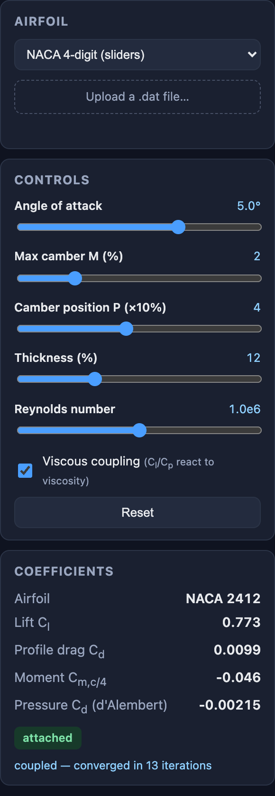
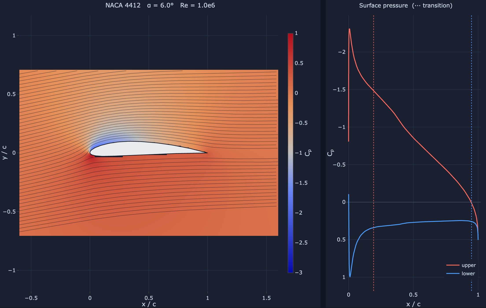
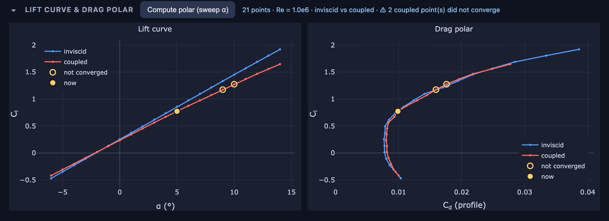

# Web UI

← [Back to the README](../README.md)

`src/web.py` starts a small **FastAPI** backend that drives the solver and returns
JSON (geometry, a `Cp` field, streamlines, surface pressure, and coefficients); a
single **Plotly.js** page renders it with live sliders. No build step — open the
printed URL. Besides the NACA sliders, the **Airfoil** panel lets you pick a
bundled sample or **upload your own `.dat` file** (see
[Loading airfoils](airfoils.md)).

The web page is a thin front-end — all physics lives in the UI-agnostic solver
core, which you can also drive directly from a script or notebook (see
[Using the solver from Python](using-python.md)).

## Starting it

```bash
uv run python src/web.py                 # serves http://127.0.0.1:8000
uv run python src/web.py --port 9000     # pick another port
```

The server prints the address to open. `--host 0.0.0.0` makes it reachable from
other machines on your network. The JSON API behind the page documents itself
interactively at `/api/docs`, for example http://127.0.0.1:8000/api/docs.

## The page at a glance



1. **Flow field** — the pressure coefficient as colour, with streamlines, around the airfoil.
2. **Surface pressure** — `Cp` along the upper and lower surfaces.
3. **Airfoil** — a NACA section from the sliders, a bundled sample, or your own `.dat` file.
4. **Controls** — angle of attack, NACA shape, Reynolds number, and viscous coupling.
5. **Coefficients** — lift, drag and moment for what is on screen.
6. **Animation** — sweep one parameter and play the result back.
7. **Lift curve & drag polar** — sweep the angle of attack.

Every change re-solves at once, so the plots and coefficients follow a slider as
you drag it.

## Choosing an airfoil and setting the flow

<p align="center">
  
</p>

**Airfoil (3).** The dropdown starts on *NACA 4-digit (sliders)*, where the shape
comes from the M, P and t sliders. It also lists the bundled samples — NACA 0012,
2412 and 4415, and the circle / golf-ball pair. Picking one, or choosing your own
file with **Upload a .dat file…**, loads and re-panels that geometry and reports
how much was read, for example *loaded 101 points → 160 panels*. While a loaded
file is in use the three shape sliders are greyed out, since M, P and t only
describe NACA sections.

**Controls (4).**

| Control | Range | Notes |
|---------|-------|-------|
| Angle of attack | −15° to 15°, in 0.1° steps | |
| Max camber M | 0 to 9 % of chord | the first NACA digit |
| Camber position P | 0 to 9 tenths of chord | the second digit; with M > 0, P = 0 snaps to 1, since camber needs a position |
| Thickness | 4 to 30 % of chord | the last two digits |
| Reynolds number | 3.2 × 10⁴ to 3.2 × 10⁷, logarithmic | chord-based; drives the boundary-layer drag estimate |

Tick **Viscous coupling** to feed the boundary layer back into the solve, so that
lift and pressure respond to viscosity (see
[How it works](how-it-works.md#two-way-viscousinviscid-coupling)). **Reset**
returns everything to the defaults — NACA 2412 at 5°, Re = 10⁶, coupling off —
and clears any animation or polar.

**Coefficients (5).** Lift `Cl`; profile drag `Cd` from the boundary layer; the
moment about the quarter chord (positive nose-up); and the pressure drag, which
is about zero without coupling — d'Alembert's paradox — and no longer exactly
zero once coupling is on. The badge reads *attached*, or *trailing-edge
separation* when the boundary layer separates ahead of 90 % chord. With coupling
on, the line beneath reports *coupled — converged in N iterations*, or a ⚠ warning
when the iteration fails to converge, which happens as you approach stall.

## Reading the plots



*NACA 4412 at α = 6°, Re = 10⁶.*

**Flow field (1).** Colour is the pressure coefficient: red is high pressure, up
to `Cp` = 1 at the stagnation point, and blue is suction. The streamlines trace
the flow around the body, and the title names the airfoil, α and Re.

**Surface pressure (2).** `Cp` along the upper (red) and lower (blue) surfaces
against x/c. The `Cp` axis is inverted, as is usual in aerodynamics, so suction
plots upward; the area between the two curves is the normal force, which at
small angles is essentially the lift. The dotted lines mark where the boundary
layer turns from laminar to turbulent on each surface.

Drag across either plot to zoom in, and double-click to zoom back out. Hover over
a pressure curve to read off its x/c and `Cp`; the flow field has no tooltips.

## Animation

Between the flow view and the polar sits an **Animation** strip: choose angle of
attack, max camber M, camber position P or thickness, give it a from/to/step
range, and **Build** sweeps that one parameter and plays the result back — the
flow field, surface pressure and coefficients all follow the sweep. Frames are
solved once and cached, so scrubbing, looping and changing speed never re-solve.
The sliders are left alone while it plays (the flow plot's title and the
animation strip show which frame is on screen), and touching any of them stops
playback and returns to live mode. A loaded `.dat` airfoil can only sweep α,
since M/P/t are NACA shape digits.

<p align="center">
  
</p>

*A thickness sweep from 6 to 24 % in steps of 2, paused at t = 18 %. On a narrow
window the strip wraps onto two lines, as here.*

Step by step:

1. **Pick the parameter.** Each one fills in a sensible range — α from −6° to 16°
   in 1° steps, for example — which you can change in **from**, **to** and
   **step**. Values outside what the solver accepts are clamped, and a sweep
   stops at 48 frames.
2. **Click Build.** Each frame is drawn as soon as it is solved, so you watch the
   sweep take shape. The button reads **Cancel** while it works.
3. **Play it.** Playback starts by itself when the build finishes. **▶ / ❚❚**
   pauses and resumes, dragging the bar scrubs through the frames, unticking
   **loop** stops at the last frame, and **slow**, **normal** and **fast** play
   at 5, 12 and 24 frames a second.

## Lift curve & drag polar

Below the flow view, a **Lift curve & drag polar** panel sweeps the angle of
attack (the **Compute polar** button) and plots `Cl` vs α and the drag polar
(`Cl` vs `Cd`), marking the current operating point. With **Viscous coupling**
on, it overlays the inviscid and coupled curves so the viscous decambering is
visible directly; coupled points where the iteration did not converge (it stops
converging as you approach stall) are ringed in amber rather than drawn as
settled answers.



*NACA 2412 at Re = 10⁶ with coupling on. The two coupled points near stall that
did not converge are ringed in amber.*

**Compute polar (sweep α)** solves α from −6° to 14° in 1° steps — 21 points —
and opens the panel; the **▸ / ▾** arrow collapses and reopens it. With coupling
on, every point is solved twice, so the sweep takes noticeably longer. The yellow
dot marks the current operating point and follows the angle-of-attack slider.
Change anything else — the airfoil, Re or coupling — and the note reads
*⟳ settings changed — click to recompute*, because the curves on screen no longer
match.
